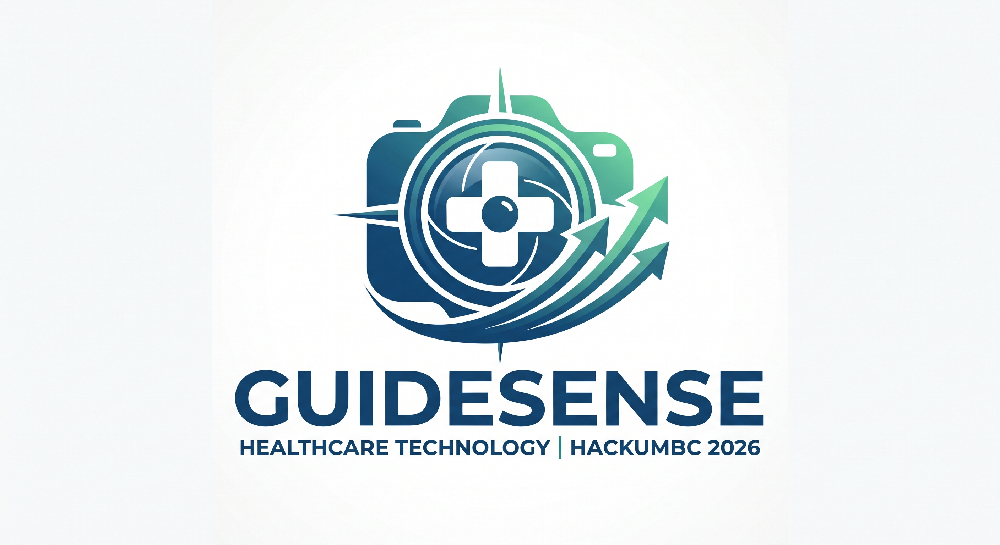

<p align="center">
  
</p>

<h1 align="center">GuideSense</h1>
<h3 align="center">Real-Time Assistive Spatial Navigation & Proximity Awareness for the Visually Impaired</h3>

<p align="center">
  <strong>Healthcare Technology Track &bull; HackUMBC 2026</strong>
</p>

<p align="center">
  
  
  
  
  
</p>

---

## 🎯 Executive Summary & Impact

Navigating unfamiliar indoor environments remains one of the greatest mobility challenges for visually impaired individuals. Traditional white canes only detect obstacles at ground level within immediate physical reach (~1 meter), while specialized electronic travel aids (LIDAR, ultrasonic vests) are prohibitively expensive ($1,000+), cumbersome, and battery-intensive.

**GuideSense** reimagines assistive navigation by transforming an accessible, low-cost commodity device—a **standard Logitech USB webcam**—into an intelligent spatial awareness companion:
- **Instant Edge Safety (Sub-100ms)**: Runs localized monocular computer vision (OpenCV MobileNet SSD) and pinhole geometric depth estimation entirely on-device, functioning with zero internet connection.
- **Spatial Directional Guidance**: Dynamically categorizes obstacles across the user's field of view into **Left, Center, and Right** corridors with three safety zones (**Near Hazard < 0.5m**, **Mid Navigation 0.5m–3.0m**, and **Far Awareness > 3.0m**).
- **Intelligent Arbitration**: A zero-flicker temporal state machine filters sensor noise, prioritizes human obstacles, and prevents repetitive announcement fatigue.
- **Multimodal Cloud Intelligence**: When internet is available, GuideSense enriches local guidance with **Google Gemini 2.5 Flash** for natural scene narration, **ElevenLabs** for human-like speech synthesis, and **Backboard** for persistent episodic memory.
- **Interactive Local Dashboard**: Zero-dependency browser HUD delivering real-time telemetry, spatial cards, and a built-in simulated demo mode for instant evaluation.

---

## ⚡ Quick Evaluation Guide for Judges (60 Seconds)

You can evaluate the complete GuideSense pipeline with or without a physical webcam connected.

### Option 1: 30-Second Browser Demo (No Webcam Required)

Experience the complete spatial awareness pipeline, HUD, and state machine using the built-in interactive demo:

```bash
# 1. Clone & create virtual environment
git clone https://github.com/Bless-04/hackUMBC2026.git
cd hackUMBC2026
python -m venv .venv

# 2. Activate & install (Windows PowerShell)
.\.venv\Scripts\python.exe -m pip install -e .
.\.venv\Scripts\python.exe -m ui
```
*(On macOS / Linux: `.venv/bin/python -m pip install -e .` then `.venv/bin/python -m ui`)*

1. Open **[http://127.0.0.1:8765](http://127.0.0.1:8765)** in your browser.
2. Click **Start session**.
3. **What to observe**: The simulated demo approaches and retreats every 18 seconds. Watch the **Awareness State** shift seamlessly between *Silent*, *Informative* (with directional callouts like *"Person, 1.8m center"*), and *Urgent Hazard* (< 0.5m).

### Option 2: Live Webcam Demonstration

Connect any standard USB webcam (tested with Logitech C270):

```bash
# Launch interactive dashboard with live camera
python -m ui
```
- In the dashboard, choose **Configure &rarr; Live camera** (select index `0` or `1`), enable **Voice & urgent alerts**, click **Save**, and click **Start session**.
- **CLI Mode**: Run directly in the terminal with OpenCV HUD preview:
  ```bash
  python main.py --camera-distance --camera 0 --preview --forever
  ```

### Option 3: Automated Test Suite & Code Verification

GuideSense adheres to strict production engineering standards:

```bash
# Run all 129 automated unit, scenario, and hardware mock tests
python -m pytest

# Run strict code quality & linting checks
python -m ruff check .
```
> **Result**: **129 passed** in ~3.5 seconds with **0 linting errors**.

---

## 🏗️ System Architecture

GuideSense combines an **edge-first critical safety loop** with an **asynchronous cloud intelligence tier**:

```text
                                  +---------------------------------------+
                                  |     Logitech USB Webcam (C270)        |
                                  +---------------------------------------+
                                                      |
                                                      v
                                        +---------------------------+
                                        |    vision/vision.py       |
                                        | (OpenCV + MobileNet SSD)  |
                                        +---------------------------+
                                                      |
                                                      v
                                        +---------------------------+
                                        | vision/distance_estimator |
                                        | (Pinhole Height Geometry) |
                                        +---------------------------+
                                                      |
                                                      v
                                        +---------------------------+
                                        |      core/fusion.py       |
                                        |  (Spatial Zone & Priority)|
                                        +---------------------------+
                                                      |
                                                      v
                                        +---------------------------+
                                        |   core/state_machine.py   |
                                        | (Hysteresis & Arbitration)|
                                        +---------------------------+
                                                      |
              +---------------------------------------+---------------------------------------+
              |                                       |                                       |
              v                                       v                                       v
+---------------------------+           +---------------------------+           +---------------------------+
|    hardware/audio.py      |           |        ui/server.py       |           |    services/ (Optional)   |
| - ElevenLabs Cloud Voice  |           | - Localhost Web Dashboard |           | - Gemini 2.5 Flash Scene  |
| - Offline Text-to-Speech  |           | - Real-Time HUD Overlay   |           | - Backboard Memory        |
| - Haptic Urgency Tone     |           | - CSV Session Telemetry   |           |                           |
+---------------------------+           +---------------------------+           +---------------------------+
```

---

## 🔬 Core Innovations & Technical Highlights

### 1. Monocular Bounding-Box Distance Estimation (`vision/`)
- Rather than requiring heavy time-of-flight or LIDAR sensors, GuideSense uses pinhole camera geometry:
  $$\text{Distance (m)} = \frac{f \times H_{\text{real}}}{h_{\text{pixels}}}$$
- Employs calibrated focal length constants ($f \approx 820$ px for Logitech C270 at 720p) and standardized real-world physical heights (e.g., person $\approx 165$ cm, chair $\approx 85$ cm, bottle $\approx 25$ cm) to estimate proximity instantaneously on modest hardware.

### 2. Zero-Flicker Spatial Fusion Engine (`core/`)
- **Horizontal Directional Zoning**: Divides the camera's field of view into three distinct directional vectors:
  - **Left**: Obstacle center $x < 35\%$ frame width.
  - **Center**: $35\% \le x \le 65\%$ frame width (direct path of travel).
  - **Right**: $x > 65\%$ frame width.
- **Three-Tier Safety Thresholds**:
  - 🚨 **Near Hazard ($< 0.50$ m)**: Triggers immediate `URGENT` alert with auditory warning tone. Zero persistence delay ensures instant reflex protection.
  - ℹ️ **Mid Corridor ($0.50$ m &ndash; $3.00$ m)**: Generates actionable directional guidance (e.g., *"Chair, 1.5 metres left"*). Requires temporal persistence (2 consecutive detections) to eliminate flickering false alarms.
  - 👁️ **Far Awareness ($> 3.00$ m)**: Tracked silently in memory to prevent cognitive clutter.
- **Hysteresis Alert Smoothing**: 1.5-second alert hysteresis ensures safety buzzer signals do not rapidly chatter on boundary distance thresholds.

### 3. Asynchronous Multimodal Cloud AI (`services/`)
- **Google Gemini 2.5 Flash Scene Narrator**: Periodically captures keyframes and asynchronously streams natural contextual scene explanations (*"There is a person standing by a desk to your left and a clear corridor ahead"*), throttled to avoid cognitive overload.
- **Backboard Persistent Memory**: Logs spatial discoveries into an episodic memory graph to recall previously navigated spaces and landmark locations.
- **ElevenLabs High-Definition Voice**: Synthesizes lifelike, calming voice announcements, gracefully falling back to native platform TTS (`pyttsx3`) if offline.

### 4. Zero-Dependency Modern Web Dashboard (`ui/`)
- Built with pure native HTML5, responsive CSS, and Vanilla JavaScript—no Node.js, Webpack, or external CDN dependencies needed.
- Live video stream with OpenCV HUD overlays, directional radar badges, active tracking tables, and one-click session telemetry CSV export.
- CSRF-hardened with loopback session tokens and explicit local private file isolation.

---

## 📂 Domain-Driven Codebase Structure

The project is structured into clear, domain-specific Python packages:

```text
hackUMBC2026/
├── core/                       # Decision core & safety arbitration
│   ├── fusion.py               # Spatial fusion, persistence, & zone categorization
│   └── state_machine.py        # System states (SILENT, INFORMATIVE, URGENT)
│
├── vision/                     # Computer vision & spatial heuristics
│   ├── vision.py               # Camera capture & OpenCV MobileNet SSD inference
│   ├── distance_estimator.py   # Bounding-box distance calculation
│   ├── distance.py             # Geometric optics formulas & object height registry
│   ├── calibrate.py            # Focal length calibration CLI
│   └── models/                 # Bundled MobileNet SSD model weights & prototxt
│
├── hardware/                   # Audio & alert actuators
│   ├── audio.py                # Cross-platform TTS voice dispatch
│   ├── audio_playback.py       # Low-latency native OS WAV player (Win/Mac/Linux)
│   ├── eleven_audio.py         # ElevenLabs cloud speech streaming
│   └── haptics.py              # Urgent hazard tone generator
│
├── services/                   # Cloud multimodal AI integrations
│   ├── gemini_narrator.py      # Google Gemini 2.5 Flash scene description
│   └── backboard_memory.py     # Backboard persistent session memory
│
├── telemetry/                  # Logging and analytics
│   └── logger.py               # Structured CSV event & frame recorder
│
├── ui/                         # User interface & dashboard
│   ├── server.py               # Loopback HTTP server & REST API
│   ├── runtime.py              # Background sensing thread & controller
│   ├── hud.py                  # Real-time OpenCV HUD targeting overlay
│   └── static/                 # Dashboard assets (CSS, JS, SVG vector icons)
│
├── tests/                      # Automated test suite (129 tests)
│   ├── test_scenarios.py       # 27 healthcare assistive scenario specs
│   ├── test_fusion.py          # Spatial fusion & directional awareness tests
│   ├── test_state_machine.py   # State transitions & hysteresis tests
│   ├── test_ui.py              # Web server, security, & session tests
│   └── test_*.py               # Cloud, audio, and distance unit tests
│
├── media/                      # Brand assets & documentation media
│   └── logo.jpg                # Official GuideSense logo
│
├── main.py                     # CLI entry point for standalone sensing
├── pyproject.toml              # Build specification & ruff/pytest config
└── requirements.txt            # Dependency manifest
```

---

## 🛠️ CLI Mode Reference

For embedded or headless operation, GuideSense can run entirely from the command line:

```bash
# 1. Run simulated demo (10 seconds)
python main.py

# 2. Run with live webcam and OpenCV visual preview
python main.py --camera-distance --camera 0 --preview --duration 30

# 3. Continuous operational mode with live camera and audio guidance
python main.py --real --camera 0 --forever

# 4. Enable optional cloud integrations via CLI
python main.py --real --camera 0 --gemini --backboard --forever
```

| Flag | Description |
| :--- | :--- |
| `--camera-distance` / `--real-vision` | Enables live camera capture and real-time distance estimation |
| `--camera <int>` | Selects camera device index (`0` for default/built-in, `1` for external USB) |
| `--preview` / `--gui` | Opens a local OpenCV window with real-time HUD bounding boxes |
| `--audio` | Enables spoken voice guidance and urgent safety buzzer tones |
| `--real` | Shorthand for `--camera-distance --audio` |
| `--gemini` | Enables asynchronous Google Gemini multimodal scene description |
| `--backboard` | Enables Backboard episodic memory logging |
| `--forever` | Runs indefinitely until `Ctrl+C` is pressed |

---

## 🔑 Environment Configuration (Optional Cloud Features)

GuideSense functions completely offline. To enable optional cloud AI capabilities, create a `.env` file in the repository root:

```ini
# Optional: Google Gemini 2.5 Flash scene narration
GEMINI_API_KEY=your_gemini_api_key_here

# Optional: ElevenLabs ultra-realistic voice guidance
ELEVEN_LABS_API_KEY=your_elevenlabs_api_key_here

# Optional: Backboard persistent memory
BACKBOARD_API_KEY=your_backboard_api_key_here
```

---

## 💻 Hardware & Cross-Platform Support

- **Camera**: Logitech C270 HD Webcam (or any USB Video Class camera / integrated laptop camera).
- **Windows**: Native audio playback via Windows multimedia APIs.
- **macOS**: Built-in system audio playback via `afplay`.
- **Linux**: Audio support via `paplay` or `aplay`.

---

<p align="center">
  <strong>Developed for HackUMBC 2026 &bull; Healthcare Technology Track</strong><br/>
  <em>Empowering greater independence and mobility through accessible, intelligent edge technology.</em>
</p>
